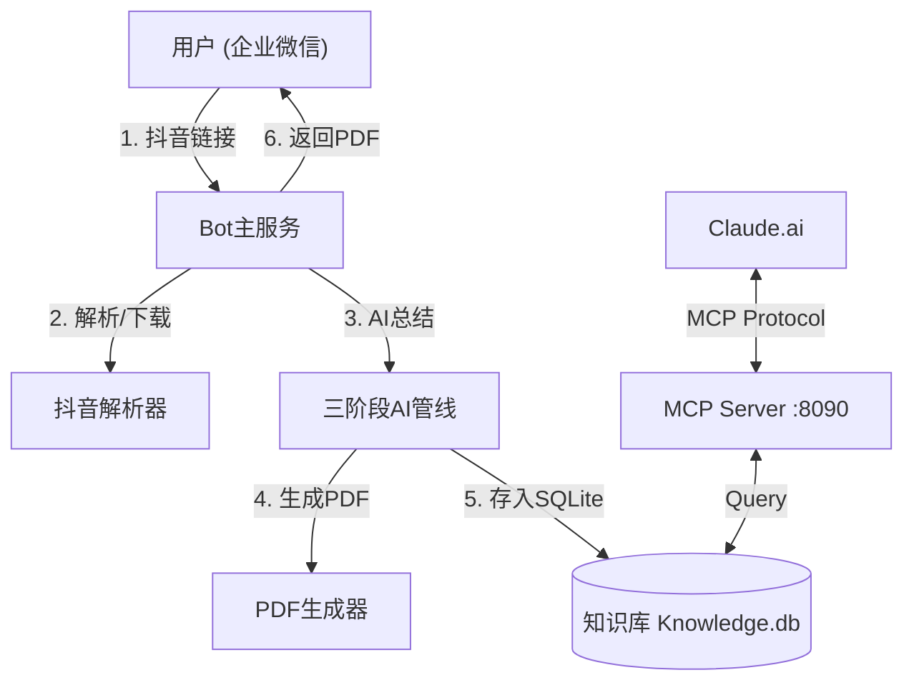

# 🎬 抖音视频知识总结 Bot

企业微信中发送抖音链接 → AI 三阶段管线自动生成结构化学习笔记 PDF。

## 核心特性

- **三阶段 AI 管线**：Gemini 转写 → DeepSeek 深度审视 → Sonnet 联网搜索增强
- **轻量级解析**：HTTP 请求模拟移动端，无需重型浏览器
- **PDF 输出**：WeasyPrint + Matplotlib 公式渲染，GitHub 风格排版，支持 LaTeX
- **交互式对话**：2分钟窗口期可追加自定义总结要求
- **知识库 & MCP**：内置 SQLite 向量/全文检索，支持 Claude.ai 联网调用知识库 (Streamable HTTP)

## 架构



## 文件结构

```
douyin-bot/
├── app/                     # 核心代码
│   ├── config.py            # 统一配置
│   ├── services/            # 业务逻辑 (AI, 解析, PDF, 微信)
│   ├── database/            # 数据存储 (SQLite/FTS5)
│   └── utils/               # 工具函数
├── deployment/              # 部署文件 (service, nginx)
├── scripts/                 # 脚本 (setup.sh)
├── main.py                  # Bot 入口
├── mcp_server.py            # MCP Server 入口
└── knowledge.db             # 知识库文件 (自动生成)
```

## 🛠️ 技术选型

- **Web 框架**: FastAPI (Python 3.11)
- **企业微信 SDK**: `WeChatCrypto` (回调加解密)
- **音频处理**: `yt-dlp` (下载), `ffmpeg` (转换/切片)
- **AI 模型**:
    - **Stage 1 (听录)**: Google Gemini 3 Pro Preview (via UIUIAPI)
    - **Stage 2 (研究)**: Alibaba Qwen-Max (via Aliyun DashScope, 支持联网搜索)
    - **Stage 3 (总结)**: Claude 4.5 Sonnet (Thinking) (via UIUIAPI, 支持自动故障切换)
- **PDF 生成**: `markdown` + `WeasyPrint` (CSS排版, LaTeX支持)
- **数据存储**: SQLite + JSON (简单高效)
- **任务队列**: `asyncio` 原生协程 (轻量级并发)

## 部署

### 1. 上传项目

```bash
scp -r douyin-bot root@服务器IP:~/
ssh root@服务器IP
cd ~/douyin-bot
```

### 2. 一键部署

```bash
chmod +x scripts/setup.sh && ./scripts/setup.sh
```
自动安装：Python3、ffmpeg、系统依赖、中文字体、Python 包。

### 3. 配置环境变量

复制 `.env.example` (参考下文) 到 `.env` 并填入配置：

```bash
# 企业微信配置
CORP_ID=your_corp_id
AGENT_ID=1000002
CORP_SECRET=your_secret
CALLBACK_TOKEN=your_token
CALLBACK_AES_KEY=your_aes_key

# API 配置 (UIUIAPI)
API_BASE_URL=https://sg.uiuiapi.com/v1
GEMINI_API_KEY=sk-...
SONNET_API_KEY=sk-...

# API 副站配置 (Failover)
SECONDARY_API_BASE_URL=https://api1.uiuiapi.com/v1
SECONDARY_GEMINI_API_KEY=sk-...
SECONDARY_SONNET_API_KEY=sk-...

# Qwen 配置 (DashScope)
DASHSCOPE_API_KEY=sk-...
QWEN_MODEL=qwen-max
```

### 4. 启动服务

```bash
# 1. 启动 Bot 服务
sudo systemctl start douyin-bot
sudo systemctl enable douyin-bot

# 2. 启动 Knowledge MCP Server (依赖 Python 3.10+)
sudo systemctl start douyin-mcp
sudo systemctl enable douyin-mcp

# 开放端口
sudo firewall-cmd --add-port=8080/tcp --permanent
sudo firewall-cmd --add-port=8090/tcp --permanent
sudo firewall-cmd --reload
```

### 5. 企业微信配置

1. 登录 [企业微信管理后台](https://work.weixin.qq.com)
2. **应用管理 → 自建 → 创建应用**
3. 设置 API 接收消息 URL: `http://你的IP:8080/wechat/callback`
4. 确保应用可见范围包含你自己

### 6. 连接 Claude (MCP)

本项目使用 **Streamable HTTP** 协议 (SSE)。需要通过 Cloudflare Tunnel 将本地 8090 端口暴露为 HTTPS。

1. **启动 Tunnel**:
   ```bash
   cloudflared tunnel --url http://localhost:8090
   ```
   复制终端输出的 URL (例如 `https://xyz.trycloudflare.com`)。

2. **配置 Claude**:
   - 打开 Claude.ai → Settings → Developer → Edit MCP Servers
   - 添加新的 MCP Server:
     - Name: `Douyin Knowledge`
     - Type: `sse`
     - URL: `https://xyz.trycloudflare.com/sse`

3. **使用**:
   在 Claude 对话中输入 "Search for video about [topic]" 即可调用知识库。

## 服务管理

```bash
# Bot 服务
sudo systemctl status douyin-bot
journalctl -u douyin-bot -f

# MCP 服务
sudo systemctl status douyin-mcp
journalctl -u douyin-mcp -f
```

## 常见问题

| 问题 | 解决方案 |
|------|----------|
| 视频解析失败 | 检查网络，部分地区 IP 可能被抖音屏蔽 |
| PDF 中文乱码 | 确认已安装 `google-noto-sans-cjk-ttc-fonts` (脚本自动安装) |
| MCP 连接失败 | 确认 Cloudflare Tunnel 正常运行，且 Claude 配置为 Streamable HTTP (SSE) |
