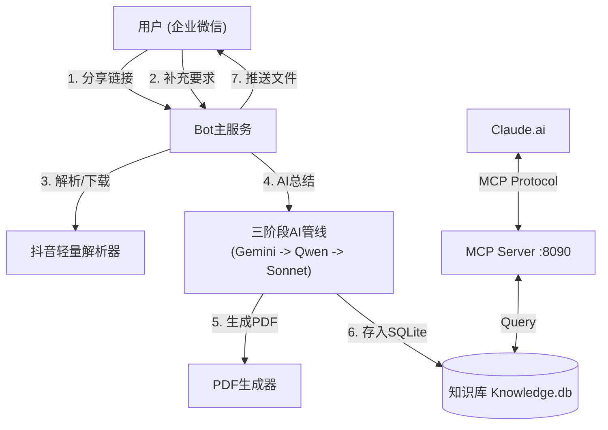

# 抖音全栈视频知识总结Bot (Douyin Full-Stack Video Summarizer)


**将抖音/TikTok 视频转化为结构化的深度学习笔记。**

这是一个运行在企业微信上的智能 Bot。发送抖音视频链接，它将自动通过 **三阶段 AI 管线**（听录 -> 深度研究 -> 总结），生成一份包含核心观点、事实核查和背景知识的精美 PDF 报告。

此外，它会自动将所有历史笔记沉淀为 **SQLite 向量知识库**，并内置 **MCP Server**，支持通过 Claude Desktop 或 Cursor 远程调用，让你随时与自己的视频知识库对话。

---

## 核心特性

### 🚀 智能交互
- **即时响应**：发送视频链接后，Bot 会立即准备就绪。
- **自定义要求**：
    - **自动开始**：发送链接后，直接发送你的具体要求（如“提取由于...的原因”、“总结为表格”），Bot 会**自动确认并立即开始**。
- **静默处理**：无需繁琐的确认指令，一切按你所想自动运行。

### 🧠 三阶段 AI 深度管线
本项目采用先进的 "Chain of Thought" 设计：
1.  **Stage 1: 全文听录 (Gemini 3 Pro)**
    - 多模态/Whisper 识别视频中的所有语音内容，生成逐字稿。
    - *支持自动故障切换 (Failover)*：主线路繁忙时自动切换备用 API。
2.  **Stage 2: 深度审视 & 联网 (Qwen-Max)**
    - **联网搜索**：不仅仅是总结，还会对视频内容进行**事实核查**。
    - **知识审计**：发现视频中的逻辑漏洞，补充缺失的背景概念。
    - **全网搜索详情**：保留详细的搜索来源和数据支撑，拒绝空洞。
3.  **Stage 3: 终稿生成 (Claude 4.5 Sonnet)**
    - 结合初稿与研究报告，由最强的逻辑模型生成最终的结构化笔记。
    - 支持复杂的 Markdown 排版和 LaTeX 公式（自动转图片渲染）。

### 📄 专业级输出
- **精美 PDF**：基于 HTML+CSS (WeasyPrint) 渲染，像 GitHub Readme 一样美观。
- **知识库沉淀**：
    - 所有历史记录存入 SQLite 数据库。
    - 支持 **FTS5 全文检索**。
- **MCP 协议支持**：
    - 内置 MCP Server，支持通过 **Claude Desktop** 或 **Cursor** 远程调用你的私人视频知识库。
    - 问 Claude："帮我找一下之前看过的关于‘量子力学’的视频笔记"，即刻检索。

---

## 🛠️ 架构图



---

## ⚡ 快速部署

### 环境要求
- Python 3.10+
- FFmpeg (必须)
- 中文字体 (用于 PDF 渲染, 推荐 Noto Sans CJK)
- 公网 IP 服务器 (用于接收企业微信回调)

### 1. 克隆与安装

```bash
git clone https://github.com/skepty2333/Douyin-full-stack-summarizer.git
cd douyin-bot
chmod +x scripts/setup.sh && ./scripts/setup.sh
```

### 2. 配置环境变量

复制 `.env.example` 为 `.env`：

```bash
cp .env.example .env
vim .env
```

| 变量类 | 变量名 | 说明 |
| :--- | :--- | :--- |
| **企业微信** | `CORP_ID` | 企业 ID |
| | `AGENT_ID` | 应用 AgentId |
| | `CORP_SECRET` | 应用 Secret |
| | `CALLBACK_TOKEN` | 回调 Token |
| | `CALLBACK_AES_KEY` | 回调 EncodingAESKey |
| **主 AI 模型** | `API_BASE_URL` | UIUIAPI 或 OpenAI 兼容地址 |
| | `GEMINI_API_KEY` | Stage 1 Key |
| | `SONNET_API_KEY` | Stage 3 Key |
| **副 AI 模型** | `SECONDARY_...` | (可选) 备用线路配置，用于故障切换 |
| **深度研究** | `DASHSCOPE_API_KEY` | 阿里云 DashScope Key (用于 Qwen) |

### 3. 启动服务

```bash
# 启动主服务
sudo systemctl start douyin-bot

# 查看日志
journalctl -u douyin-bot -f
```

---

## 📖 使用指南

### 基础用法
1. 在抖音 APP 中点击分享 -> **复制链接**。
2. 在企业微信中发送给 Bot。
3. Bot 回复“收到...”。
4. **如果无需额外要求**：发送“**开始**”或等待 2 分钟，Bot 自动运行。
5. **如果有要求**：直接发送“**总结一下其中的商业模式**”。
    - Bot 会回复“已收到补充要求，正在开始处理...”。
    - 随后自动开始，无需再发指令。

### 高级用法 (MCP)
如果你使用 Claude.ai 或 Cursor：
1. 启动 `mcp_server.py` (通常由 systemd 管理)。
2. 使用 `cloudflared` 将 8090 端口暴露为 HTTPS。
3. 在 Claude 中配置 MCP Server URL。
4. 对话示例：
   > "查询我的知识库，最近有没有关于‘AI 编程’的视频？"

---

## 🔧 常见问题 (FAQ)

**Q: 为什么 PDF 中的中文是乱码？**
A: 服务器缺少中文字体。`setup.sh` 脚本会自动尝试安装 `google-noto-sans-cjk-ttc-fonts`。如果失败，请手动安装字体并刷新缓存 (`fc-cache -fv`)。

**Q: 解析失败或下载慢？**
A: 抖音对数据中心 IP 有反爬策略。建议使用家庭宽带 IP 或尝试更替服务器 IP。

**Q: 备用线路是什么？**
A: 系统内置了高可用逻辑。当主 API (如 UIUIAPI) 返回 429 或 5xx 错误时，系统会自动尝试 `SECONDARY_` 配置的 API Key，确保服务稳定性。

**Q: UIUIAPI 不稳定经常报错？**
A: UIUIAPI 作为第三方中转服务，可能会出现偶发性波动 (429/502)。建议**务必配置备用线路** (`SECONDARY_...`)，可以使用官方 Key 或其他中转服务作为兜底，Bot 会自动处理切换。

---

## 📜 许可证

MIT License
