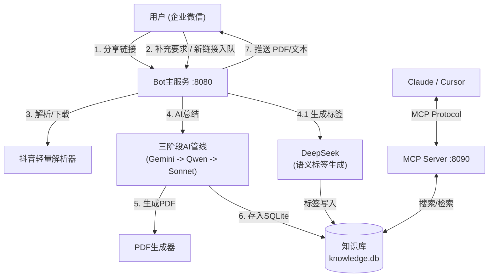

# 抖音全栈视频知识总结Bot (Douyin Full-Stack Video Summarizer)


**将抖音/TikTok 视频转化为结构化的深度学习笔记。**

这是一个运行在企业微信上的智能 Bot。发送抖音视频链接，它将自动通过 **三阶段 AI 管线**（听录 -> 深度研究 -> 总结），生成一份包含核心观点、事实核查和背景知识的精美 PDF 报告。

所有笔记自动沉淀为 **SQLite 知识库**，并通过 **AI 语义标签** 驱动检索。内置 **MCP Server** 支持 **Claude / Cursor** 远程调用，随时与个人视频知识库对话。

---

## 核心特性

### 智能交互 & 任务队列
- **即时响应**：发送视频链接后，Bot 立即准备就绪。
- **自定义要求**：发送链接后直接发送具体要求（如"总结为表格"），Bot 自动确认并立即开始。
- **任务队列**：处理中可继续发送新链接，自动排队（每用户最多 3 个），前序任务完成后自动处理下一个。
- **队列状态查询**：发送"队列"或"状态"可查看当前排队情况。
- **重复检测**：自动识别已处理过的视频，支持覆盖或新增。

### 三阶段 AI 深度管线

| 阶段 | 模型 | 功能 |
|:---:|:---:|:---|
| **Stage 1** | Gemini 3 Pro | 多模态/Whisper 语音识别，生成逐字稿。支持主/备自动故障切换。 |
| **Stage 2** | Qwen-Max | 联网搜索 + 事实核查 + 知识补充，发现逻辑漏洞，保留搜索来源。 |
| **Stage 3** | Claude Sonnet 4.5 | 结合初稿与研究报告，生成最终结构化笔记，支持 Markdown + LaTeX。 |

### 知识库 & 检索
- **AI 语义标签**：每篇笔记由 DeepSeek 自动生成 5-10 个语义化检索标签（如"AI编程,智能体,强化学习"），替代传统关键词提取。
- **三层搜索策略**：标签 LIKE 匹配 → FTS5 全文检索 → LIKE 兜底，确保高召回率。
- **精确搜索**：支持 AND 逻辑多关键词精确匹配，快速缩小范围。
- **MCP 协议**：Claude / Cursor 远程调用知识库，7 个 MCP 工具覆盖搜索/检索/统计。

### 专业级输出
- **精美 PDF**：基于 HTML+CSS (WeasyPrint) 渲染，支持中文字体、加粗、LaTeX 公式。
- **多格式交付**：PDF 优先，失败时自动降级为 Markdown 文本。

---

## 架构图


```mermaid
graph TD
    User["用户 (企业微信)"] -->|1. 分享链接| Server["Bot主服务 :8080"]
    User -->|2. 补充要求 / 新链接入队| Server
    Server -->|3. 解析/下载| Parser["抖音轻量解析器"]
    Server -->|4. AI总结| AI["三阶段AI管线\n(Gemini -> Qwen -> Sonnet)"]
    Server -->|4.1 生成标签| DS["DeepSeek\n(语义标签生成)"]
    AI -->|5. 生成PDF| PDF["PDF生成器"]
    AI -->|6. 存入SQLite| DB[("知识库\nknowledge.db")]
    DS -->|标签写入| DB
    
    Claude["Claude / Cursor"] <-->|MCP Protocol| MCPServer["MCP Server :8090"]
    MCPServer <-->|搜索/检索| DB
    
    Server -->|7. 推送 PDF/文本| User
```

---

## 快速部署

### 环境要求
- Python 3.10+
- FFmpeg (必须)
- 中文字体 (用于 PDF 渲染, 推荐 Noto Sans CJK)
- 公网 IP 服务器 (用于接收企业微信回调)

### 1. 克隆与安装

```bash
git clone https://github.com/skepty2333/Douyin-full-stack-summarizer.git
cd douyin-bot
chmod +x scripts/setup.sh && ./scripts/setup.sh
```

### 2. 配置环境变量

复制 `.env.example` 为 `.env`：

```bash
cp .env.example .env
vim .env
```

| 变量类 | 变量名 | 说明 |
| :--- | :--- | :--- |
| **企业微信** | `CORP_ID` | 企业 ID |
| | `AGENT_ID` | 应用 AgentId |
| | `CORP_SECRET` | 应用 Secret |
| | `CALLBACK_TOKEN` | 回调 Token |
| | `CALLBACK_AES_KEY` | 回调 EncodingAESKey |
| **Stage 1** | `API_BASE_URL` | OpenAI 兼容 API 地址 |
| | `GEMINI_API_KEY` | Gemini Key |
| **Stage 2** | `DASHSCOPE_API_KEY` | 阿里云 DashScope Key (Qwen) |
| **Stage 3** | `SONNET_API_KEY` | Sonnet Key |
| **标签生成** | `DEEPSEEK_API_KEY` | DeepSeek Key (语义标签) |
| | `DEEPSEEK_MODEL` | 默认 `deepseek-chat` |
| **备用线路** | `SECONDARY_...` | (可选) 故障切换配置 |

### 3. 启动服务

```bash
# 启动主服务 (企业微信 Bot)
sudo systemctl start douyin-bot

# 启动 MCP Server (知识库检索)
sudo systemctl start mcp-server

# 查看日志
journalctl -u douyin-bot -f
```

---

## 使用指南

### 基础用法
1. 在抖音 APP 中**复制链接**。
2. 发送给企业微信 Bot。
3. **无需额外要求**：发送"开始"或等待 2 分钟自动处理。
4. **有具体要求**：直接发送要求文本，Bot 自动确认并开始。

### 任务队列
- 处理中发送新链接 → 自动入队。
- 发送"**队列**"或"**状态**" → 查看排队情况。
- 每用户最多排队 3 个任务，前序完成后自动处理。

### 重复视频处理
- Bot 自动检测同标题/同作者的历史记录。
- 输入"**覆盖**"替换旧记录，"**新增**"保留两份，"**取消**"放弃。

### MCP 知识库检索

启动 MCP Server 后，通过 Claude / Cursor 调用：

| MCP 工具 | 功能 |
|:---|:---|
| `search_notes` | 宽松搜索（OR 逻辑），覆盖面广 |
| `search_notes_precise` | 精确搜索（AND 逻辑），所有关键词必须同时命中 |
| `get_note` / `get_note_by_code` | 通过 ID 或视频码获取完整笔记 |
| `list_notes` | 列出最近笔记 |
| `list_by_tag` | 按标签筛选 |
| `knowledge_stats` | 知识库统计 |

对话示例：
> "帮我找关于'量化交易'的视频笔记" → `search_notes`
> 
> "找同时提到'AI编程'和'开源项目'的笔记" → `search_notes_precise`

---

## 项目结构

```
douyin-bot/
├── main.py                          # 主服务入口 (FastAPI)
├── mcp_server.py                    # MCP Server (知识库检索)
├── app/
│   ├── config.py                    # 配置管理
│   ├── database/
│   │   └── knowledge_store.py       # SQLite 知识库 (FTS5 + 标签搜索)
│   ├── services/
│   │   ├── ai_summarizer.py         # 三阶段 AI 管线 + DeepSeek 标签生成
│   │   ├── douyin_parser.py         # 抖音视频解析/下载
│   │   ├── pdf_generator.py         # PDF 渲染 (WeasyPrint)
│   │   └── wechat_api.py            # 企业微信 API
│   └── utils/
│       └── wechat_crypto.py         # 消息加解密
├── scripts/
│   └── setup.sh                     # 环境安装脚本
└── knowledge.db                     # SQLite 知识库
```

---

## 常见问题

**Q: PDF 中文乱码？**
服务器缺少中文字体。运行 `setup.sh` 或手动安装 `google-noto-sans-cjk-ttc-fonts`，刷新缓存 `fc-cache -fv`。

**Q: 解析失败或下载慢？**
抖音对数据中心 IP 有反爬策略。建议使用家庭宽带 IP 或更替服务器 IP。

**Q: 备用线路是什么？**
当主 API 返回 429/5xx 错误时，系统自动切换 `SECONDARY_` 配置的备用 Key，确保服务稳定。务必配置备用线路。

**Q: 标签生成失败？**
如果 DeepSeek API 调用失败，系统会自动回退到正则提取（从 Markdown 加粗词中提取）。优先确保 `DEEPSEEK_API_KEY` 配置正确。

---

## 许可证

MIT License
